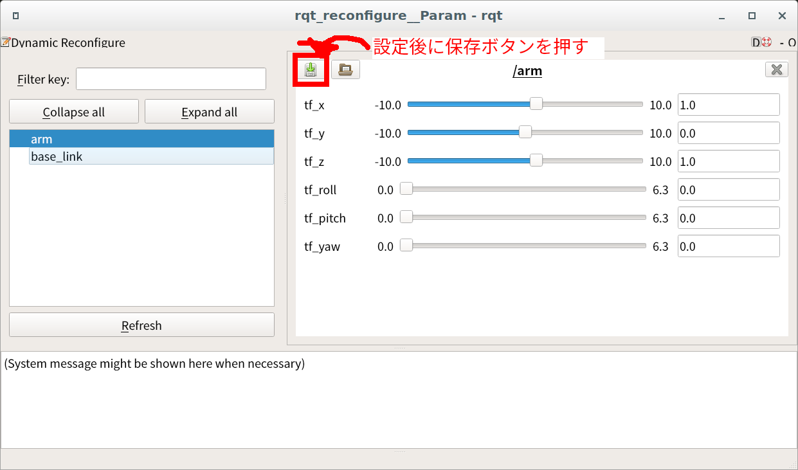

# Tunable static tf broadcaster
dynamic_reconfigureを用いて、GUIでtf2のxyzrpyを変更してbroadcastするノード


## 動作
以下を参考にxyzrpyをdynamic_reconfigureでいじれるようにしている
- http://wiki.ros.org/tf2/Tutorials/Writing%20a%20tf2%20static%20broadcaster%20%28Python%29

## quick start
```
roslaunch tunable_static_tf_broadcaster sample.launch
```

## tfのフレームの増やし方
tunable_static_tf_broadcaster_nodeを複数立ち上げることでフレームを増やせます。

1. sample.launchをコピーして適当な名前をつける
2. 以下のノードのブロックを追加していく

```
  <!-- 追加するノード -->
  <node name="ノード名" pkg="tunable_static_tf_broadcaster" type="tunable_static_tf_broadcaster_node.py" >
    <param name="rate" value="10.0" type="double" /> <!-- tfの更新レート[Hz]-->
    <param name="header_frame" value="親フレームのID" type="string" /> <!-- tfのヘッダフレームID -->
    <param name="child_frame" value="子のフレームID" type="string" /> <!-- tfの子フレームID-->
    <param name="yaml" value="$(find tunable_static_tf_broadcaster)/params/初期化に使うyaml" type="string" /> <!-- 初期化用yaml -->
  </node>
```

## dynamic_reconfigureで設定したパラメータをロードする方法
1. dynamic_reconfigureで適切なパラメータを設定し、GUIからyamlを保存する



2. 保存したyamlをlaunchで起動時にロードするように設定する。以下のような行を追加する

```
<node name="load_ロードする設定名" pkg="dynamic_reconfigure" type="dynparam" args="load dynamic_reconfigureの名前 $(find tunable_static_tf_broadcaster)/params/パラメータファイル.yaml" />
```
